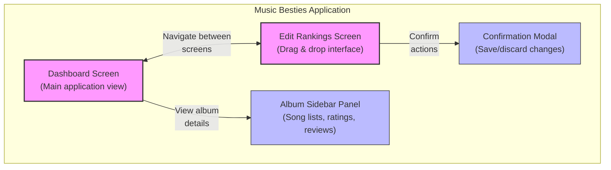

```mermaid
flowchart TD
    subgraph MusicBesties["Music Besties Application"]
        Dashboard["Dashboard Screen\n(Main application view)"] <--"Navigate between\nscreens"--> EditRankings["Edit Rankings Screen\n(Drag & drop interface)"];
        
        Dashboard -->|"View album\ndetails"| AlbumSidebar["Album Sidebar Panel\n(Song lists, ratings, reviews)"];
        EditRankings -->|"Confirm\nactions"| ConfirmationModal["Confirmation Modal\n(Save/discard changes)"];
        
        classDef screens fill:#f9f,stroke:#333,stroke-width:2px;
        classDef components fill:#bbf,stroke:#333,stroke-width:1px;
        
        class Dashboard,EditRankings screens;
        class AlbumSidebar,ConfirmationModal components;
    end
    
    %% Add tooltips for additional context
    click Dashboard "#" "Primary view for album collection"
    click EditRankings "#" "Interface for ranking songs"
    click AlbumSidebar "#" "Displays detailed album information"
    click ConfirmationModal "#" "Prevents accidental data loss"
```
