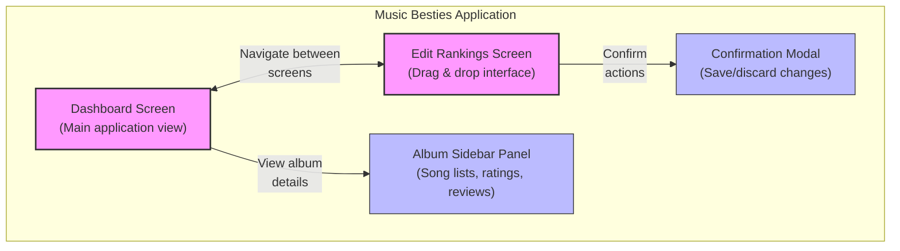

# Application Overview

## High-Level Architecture

Music Besties follows a component-based architecture that promotes modularity, reusability, and maintainability. The application consists of two primary screens with supporting components that work together to create a cohesive user experience.

**Figure: Application Architecture**



*Visual representation of the component relationships showing how the Dashboard and Edit Rankings screens interact with supporting panels. Provides developers with a clear understanding of the application's structural organization and navigation flow between major components.*

### 2.2. Component Specifications

For implementation by the production team, here are the detailed specifications of key components:

**Figure 2.2.20: DashboardCard Component Specification**

```
+----------------------------------+
| Component: DashboardCard         |
+----------------------------------+
| Props:                           |
| - tabId: string (required)       |
|   Album identifier               |
| - title: string (required)       |
|   Album title to display         |
| - emoji: string                  |
|   Emoji character for album      |
| - rating: number (0-5)           |
|   User's rating (whole numbers)  |
| - selectedCount: number          |
|   Number of selected songs       |
| - totalCount: number (required)  |
|   Total number of songs          |
+----------------------------------+
| Events:                          |
| - @open-sidebar: Emitted when    |
|   card is clicked                |
|   Payload: tabId                 |
+----------------------------------+
| CSS Classes:                     |
| - dashboard-grid-card            |
| - dashboard-stars                |
+----------------------------------+
```

*Technical blueprint detailing all required props, emitted events, and CSS classes for the album card component. Enables consistent implementation of album cards with proper data validation and event handling.*

**Figure 2.2.30: SidebarPanel Component Specification**

```
+----------------------------------+
| Component: SidebarPanel          |
+----------------------------------+
| Props:                           |
| - visible: boolean (required)    |
|   Controls panel visibility      |
| - tabId: string (required)       |
|   Current active album id        |
| - tabTitle: string (required)    |
|   Title to display in panel      |
| - sidebarTabs: Array (required)  |
|   Tab configuration objects      |
+----------------------------------+
| Events:                          |
| - @close: When panel closes      |
| - @switch-tab: When tab changes  |
|   Payload: tabId                 |
+----------------------------------+
| CSS Classes:                     |
| - fixed inset-0                  |
| - max-w-sm                       |
| - bg-white shadow-xl             |
+----------------------------------+
```

*Complete interface definition for the sliding panel including visibility controls and tab management. Ensures proper implementation of the panel's responsive behavior and event communication with parent components.*

**Figure 2.2.40: EditRankingsTabs Component Specification**

```
+----------------------------------+
| Component: EditRankingsTabs      |
+----------------------------------+
| Props:                           |
| - tabs: Array (required)         |
|   Tab configuration objects      |
| - activeTab: string (required)   |
|   Current active tab id          |
| - rankedItems: Array (required)  |
|   Items in ranked order          |
| - unrankedItems: Array (required)|
|   Items not yet ranked           |
+----------------------------------+
| Events:                          |
| - @switch-tab: When tab changes  |
|   Payload: tabId                 |
| - @toggle-rank: When item rank   |
|   changes                        |
|   Payload: {id, ranked}          |
+----------------------------------+
| CSS Classes:                     |
| - flex flex-col flex-grow        |
| - overflow-x-auto                |
| - sticky top-14 z-10             |
+----------------------------------+
```

*Technical requirements for the tab navigation system including data structures for ranked and unranked items. Facilitates correct implementation of the ranking interface with proper state management.*
