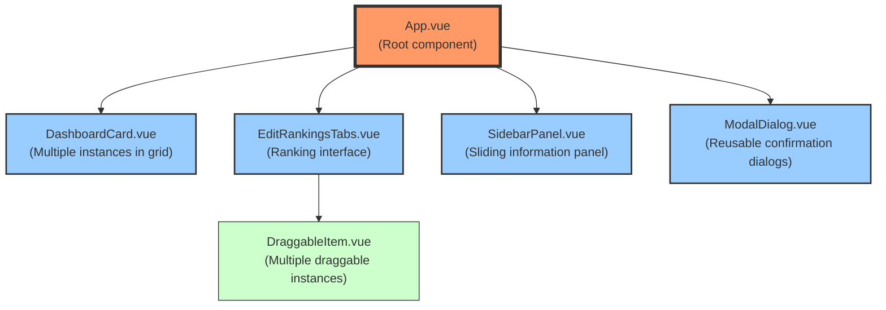

# Component Details

This section provides detailed specifications for the key components in the Music Besties application.

## Component Hierarchy

The application is structured around these key components, which are implemented in Vue.js:

**Figure: Component Hierarchy**



*Tree diagram showing the Vue.js component inheritance and composition structure from App.vue down to individual UI elements. Helps developers understand component dependencies and the proper location for implementing new features or modifications.*

- **App.vue**: The root component that manages routing and global state
- **DashboardCard.vue**: Reusable component for album display on the dashboard
- **EditRankingsTabs.vue**: Container for the ranking interface with tabs
- **DraggableItem.vue**: Interactive component for selection functionality
- **SidebarPanel.vue**: Sliding panel for detailed album information
- **ModalDialog.vue**: Reusable dialog component for confirmations

### Component: DashboardCard

| Property      | Type             | Required | Description                     |
|---------------|------------------|----------|---------------------------------|
| `tabId`       | `string`         | Yes      | Album identifier                |
| `title`       | `string`         | Yes      | Album title to display          |
| `emoji`       | `string`         | No       | Emoji character for album       |
| `rating`      | `number` (0-5)   | No       | User's rating (whole numbers)   |
| `selectedCount` | `number`         | No       | Number of selected songs        |
| `totalCount`  | `number`         | Yes      | Total number of songs           |

**Events:**

| Event         | Payload           | Description                      |
|---------------|-------------------|----------------------------------|
| `@open-sidebar` | `tabId: string`   | Emitted when card is clicked      |

**CSS Classes:**

* `dashboard-grid-card`
* `dashboard-stars`
```

## 4.2. Album Sidebar Panel

### 4.2.1. Panel Structure and Functionality

The Album Sidebar Panel is a sliding panel that provides detailed information about a selected album. It includes the following features:

- Album title and emoji
- List of songs
- Rating and review information
- Navigation to other albums

### 4.2.2. Album Example

The sidebar panel displays album information in a structured format, with clear sections for songs, ratings, and reviews.

**Figure 4.1.10: Album Sidebar Panel Layout**

```
+-----------------------------------------------------+
|  ← Red ❤️                                          |
+-----------------------------------------------------+
|                                                     |
| Songs:                                              |
|                                                     |
| Ranked:                                             |
| 1. All Too Well                                     |
| 2. State of Grace                                   |
| 3. 22                                               |
|                                                     |
| Unranked:                                           |
| • Red                                               |
| • I Knew You Were Trouble                           |
| • We Are Never Ever Getting Back Together           |
| • Begin Again                                       |
| • Holy Ground                                       |
| • The Last Time                                     |
| • I Almost Do                                       |
|                                                     |
| Your Review:                                        |
| ★★★★★                                              |
| "This album perfectly captures the emotions of      |
| heartbreak and moving on. All Too Well is an        |
| absolute masterpiece."                              |
|                                                     |
| Last updated: May 5, 2025                           |
|                                                     |
+-----------------------------------------------------+
```

*Detailed panel structure showing the song ranking interface with numbered positions and the scrollable unranked songs section. Demonstrates how the component handles varying amounts of content through scrolling while maintaining a consistent visual structure.*

## 4.3. Review Panel

The Review Panel allows users to add and edit reviews for albums. It includes:

- Star rating system (0-5 stars)
- Text input for comments
- Save and cancel buttons
- Timestamp information for when the review was last updated

**Figure 4.2.10: Review Panel Layout**

```
+-----------------------------------------------------+
|  Edit Review: Red ❤️                               |
+-----------------------------------------------------+
|                                                     |
| Rating:                                             |
|                                                     |
| ★★★★★                                              |
| ☆☆☆☆☆                                              |
|                                                     |
| Comments:                                           |
|                                                     |
| +---------------------------------------------------+
| | This album perfectly captures the emotions of     |
| | heartbreak and moving on. All Too Well is an      |
| | absolute masterpiece.                             |
| |                                                   |
| |                                                   |
| +---------------------------------------------------+
|                                                     |
| Last updated: May 5, 2025                           |
|                                                     |
| [Save]                [Cancel]                      |
|                                                     |
+-----------------------------------------------------+
```

*Comprehensive view of the star rating system and comment field with timestamp display for album reviews. Shows the expected input mechanisms and data display for the review creation and viewing process.*