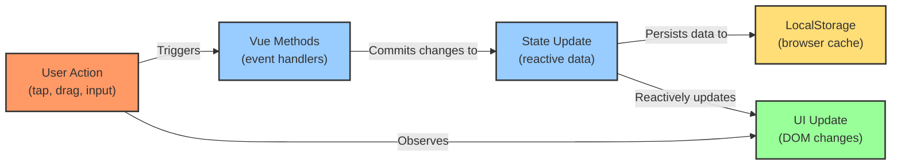

# Developer Implementation Guide

This section provides guidelines and best practices for developers working on the Music Besties application.

## Implementation Checklist

When implementing new features or modifying existing components, use this checklist to ensure consistency:

**Figure: Implementation Checklist**

```
+----------------------------------+
| Implementation Checklist         |
+----------------------------------+
| ☐ Component props validated      |
| ☐ Event handlers connected       |
| ☐ LocalStorage updates confirmed |
| ☐ Responsive behavior tested     |
| ☐ Accessibility requirements met |
| ☐ State management integrated    |
+----------------------------------+
```

*Comprehensive verification steps for ensuring all aspects of component implementation meet application standards. Serves as a quality assurance tool for developers to validate their implementation against established requirements.*

## 8.2. Data Flow Implementation

The application's data flow is implemented as follows:

**Figure 8.2.10: Data Flow Implementation**



*Technical process diagram showing the complete cycle from user actions through Vue methods to state updates and UI rendering. Illustrates the expected implementation pattern for maintaining data consistency between user interactions and persistent storage.*

Key methods involved in this flow include:
- `toggleItemRank()`: Updates ranking order when an item is tapped
- `saveAndExit()`: Persists changes to LocalStorage and returns to dashboard
- `setup()`: Initializes state from LocalStorage on component mount
- `updateReview()`: Saves review changes to LocalStorage

## 8.3. Interaction Implementation

The ranking functionality is implemented through click/tap handlers:

**Figure 8.3.10: Ranking Interaction Implementation**

```
+----------------------------------+
| Ranking Interaction              |
+----------------------------------+
| Implementation:                  |
| - Click handler: toggleItemRank()|
| - State update: Updates array    |
|   order in currentSelectionOrders|
| - Visual feedback: Applies       |
|   .chip-rank-indicator class     |
|   with position number           |
+----------------------------------+
```

*Technical details of how the ranking interaction is implemented in code, including the specific methods, state updates, and CSS classes involved. Provides developers with concrete implementation guidance for maintaining or extending the ranking functionality.*

The star rating system is implemented using:
- Whole star characters (★ and ☆)
- Click handlers to set the rating value (1-5)
- Visual feedback showing the selected rating

## 8.4. Performance Considerations

For optimal performance when implementing new features:

1. Minimize DOM manipulations
2. Use Vue's reactive system for state changes
3. Implement proper cleanup in component unmount hooks
4. Leverage browser caching for LocalStorage data
5. Keep the bundle size small by avoiding unnecessary dependencies

## 8.5. Accessibility Guidelines

To ensure the application is accessible to all users:

1. Use semantic HTML elements
2. Provide appropriate ARIA attributes
3. Ensure keyboard navigation works for all interactive elements
4. Maintain sufficient color contrast
5. Test with screen readers

## 8.6. Code Style and Conventions

Follow these conventions to maintain code consistency:

1. Use camelCase for variable and function names
2. Use PascalCase for component names
3. Use kebab-case for CSS class names
4. Document component props and events
5. Use descriptive names for functions and variables

By following these implementation guidelines, developers can maintain consistency with the existing codebase while ensuring the application remains performant and maintainable.