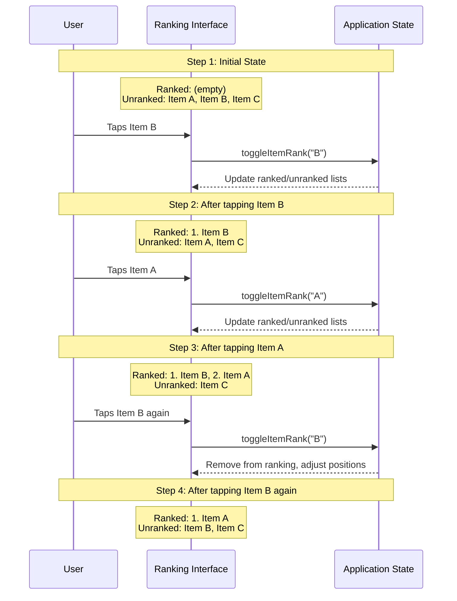

# User Interactions

This section details the key user interaction patterns in the Music Besties application.

## Ranking Workflow

**Figure: Ranking Interaction Flow**

*Step-by-step visualization of how items transition between ranked and unranked states through user tap interactions. Clarifies the exact behavior expected when users interact with rankable items, including the visual state changes.*

### 5.1.1. Album Ranking

The album ranking workflow allows users to create a personalized ranking of their favorite albums. The process works as follows:

1. User navigates to the Edit Rankings Screen
2. User selects the "Albums" tab
3. User taps on unranked albums to add them to the ranked list
4. User can reorder ranked albums by dragging and dropping
5. User taps on ranked albums to remove them from the ranking
6. User saves changes to persist the ranking

### 5.1.2. Song Ranking

The song ranking workflow allows users to create a personalized ranking of songs within an album. The process works as follows:

1. User navigates to the Edit Rankings Screen
2. User selects an album-specific tab
3. User taps on unranked songs to add them to the ranked list
4. User can reorder ranked songs by dragging and dropping
5. User taps on ranked songs to remove them from the ranking
6. User saves changes to persist the ranking

## 5.2. Review Workflow

### 5.2.1. Creating/Editing Reviews

The review creation workflow allows users to add ratings and comments to albums. The process works as follows:

1. User navigates to the Dashboard Screen
2. User taps on an album to open the Sidebar Panel
3. User taps on the review section
4. User sets a star rating (0-5 stars)
5. User adds a text comment (optional)
6. User saves the review to persist the changes

### 5.2.2. Viewing Reviews

Users can view reviews for albums through the Sidebar Panel. The process works as follows:

1. User navigates to the Dashboard Screen
2. User taps on an album to open the Sidebar Panel
3. The review section displays the current rating and comment
4. User can tap on the review section to edit the review

## 5.3. Navigation Patterns

### 5.3.1. Dashboard Navigation

The Dashboard Screen provides the following navigation options:

- Tapping on an album card opens the Sidebar Panel for that album
- Tapping on the ranking button navigates to the Edit Rankings Screen

### 5.3.2. Edit Rankings Navigation

The Edit Rankings Screen provides the following navigation options:

- Tabs at the top allow switching between different ranking categories
- The back button returns to the Dashboard Screen
- The save button persists changes and returns to the Dashboard Screen

### 5.3.3. Sidebar Panel Navigation

The Sidebar Panel provides the following navigation options:

- The close button closes the panel and returns to the Dashboard Screen
- Tabs at the top allow switching between different albums
- The edit button navigates to the Edit Rankings Screen for the current album