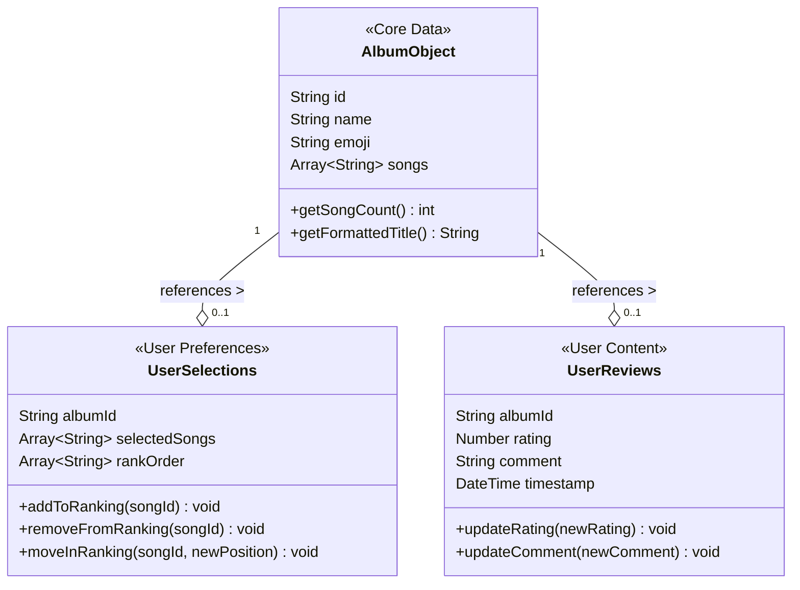
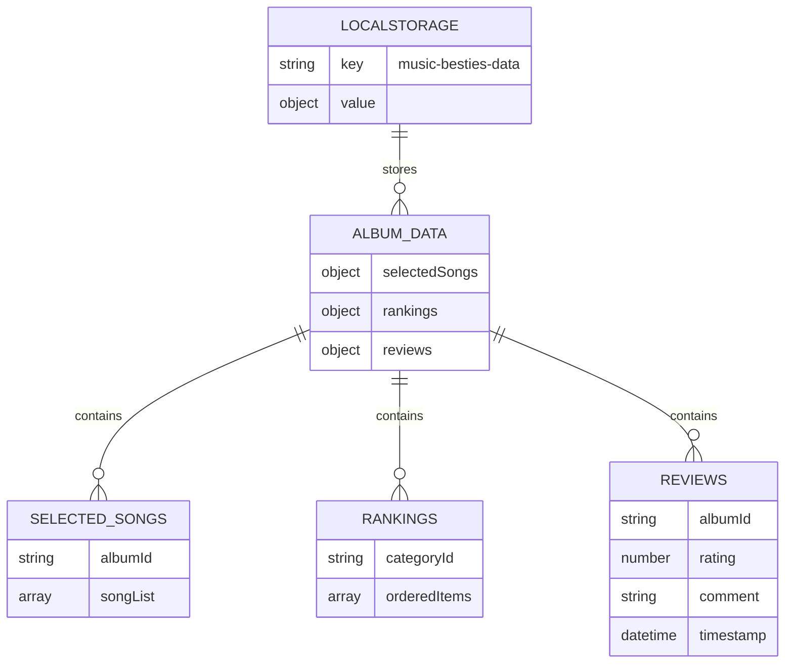

# Technical Implementation

This section details the technical implementation of the Music Besties application.

## Data Management

The application's data structure is organized as shown in this diagram, which represents the conceptual model rather than the exact implementation:

**Figure: Data Structure Model**



*Conceptual diagram showing the relationships and composition of album objects, user selections, and review data. Provides developers with an understanding of the data architecture to properly implement state management.*

### 6.1.1. Album Metadata

The application manages album metadata including:
- Album ID (e.g., 'taylor-swift', 'red')
- Album name (e.g., 'Taylor Swift', 'Red')
- Representative emoji (e.g., 🤠, ❤️)
- List of songs for each album

### 6.1.2. User Data

User-specific data includes:
- Selected songs for each album
- Ranking order of albums and songs
- Star ratings (whole numbers from 0-5)
- Text comments for album reviews

### 6.1.3. State Structure

The application's state is stored in LocalStorage with this structure:

**Figure 6.1.30: LocalStorage Data Structure**



*Exact JSON structure showing the format of stored data including selectedSongs, rankings, and reviews with their nested properties. Ensures consistent data persistence implementation with the correct property names and data types.*

This structure is accessed via the key 'music-besties-data' in the browser's LocalStorage. The application loads this data on startup and updates it when changes are made to rankings or reviews.

## 6.2. Storage Mechanisms

### 6.2.1. LocalStorage

The application uses the browser's LocalStorage API to persist user data between sessions. This approach has the following advantages:

- No server-side storage requirements
- Data remains available even when offline
- Simple API for storing and retrieving JSON data

However, it also has limitations:

- Limited storage capacity (typically 5-10MB)
- Data is specific to a browser and device
- No synchronization between devices

### 6.2.2. In-memory State

During runtime, the application maintains an in-memory state that is synchronized with LocalStorage. This approach provides:

- Fast access to data during user interactions
- Ability to make temporary changes before persisting
- Simplified state management through Vue.js reactivity

## 6.3. Framework and Libraries

### 6.3.1. Vue.js Framework

The application is built using the Vue.js framework, which provides:

- Component-based architecture
- Reactive data binding
- Declarative templating
- Event handling system
- State management

### 6.3.2. Interactive Selection

The application implements interactive selection through:

- Click/tap event handlers
- Vue.js reactive data binding
- CSS transitions for visual feedback

### 6.3.3. CSS Implementation

The application uses Tailwind CSS for styling with these specific utility classes:

```
+----------------------------------+
| Responsive Layout Classes        |
+----------------------------------+
| Mobile (Default):                |
| - grid-cols-2                    |
| - p-4                            |
| - text-sm                        |
|                                  |
| Tablet+ (sm:):                   |
| - sm:grid-cols-3                 |
| - sm:p-6                         |
| - sm:gap-4                       |
+----------------------------------+
```

Key component-specific classes:
- `dashboard-grid-card`: Base styling for album cards
- `dashboard-stars`: Styling for star rating display
- `fixed inset-0`: Full-screen overlay for sidebar panels
- `max-w-sm`: Width constraint for sidebar on larger screens
- `bg-white shadow-xl`: Visual styling for panels
- `flex flex-col flex-grow`: Layout structure for tab containers
- `sticky top-14 z-10`: Positioning for fixed tab navigation