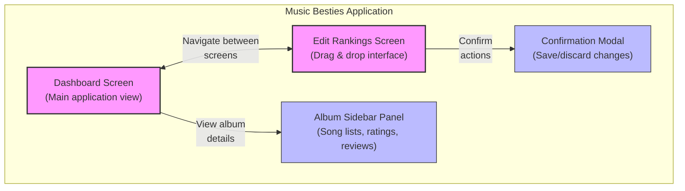
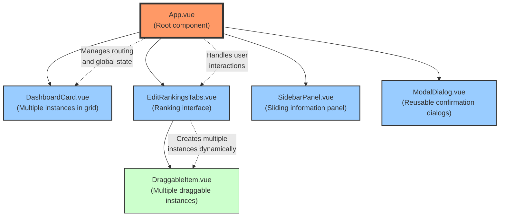
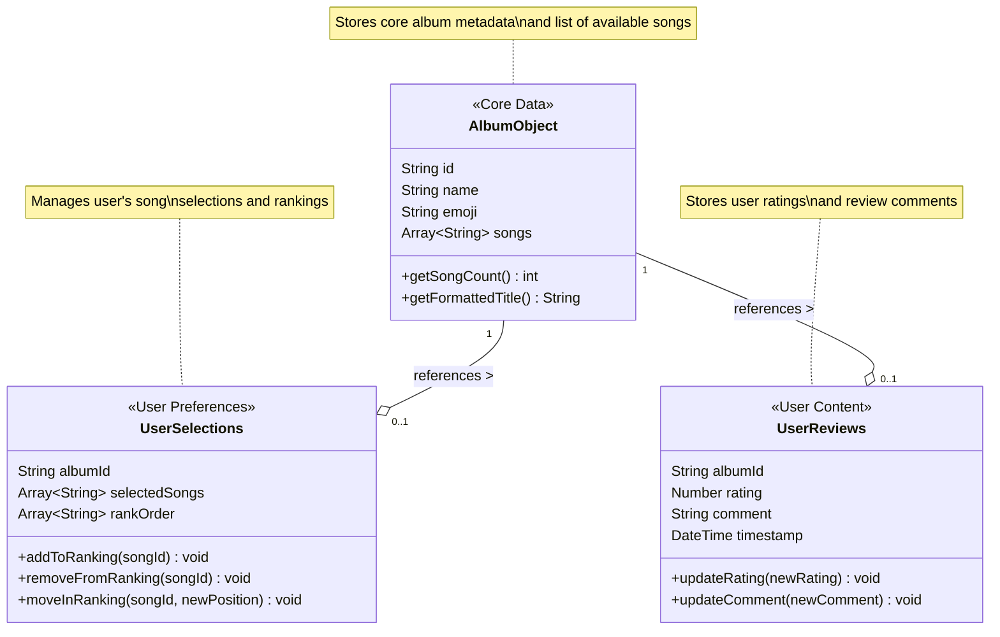
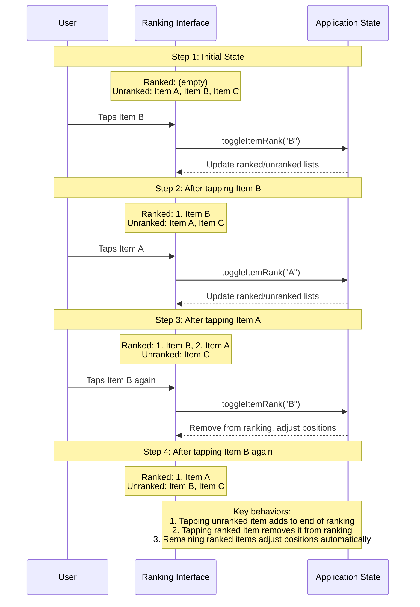
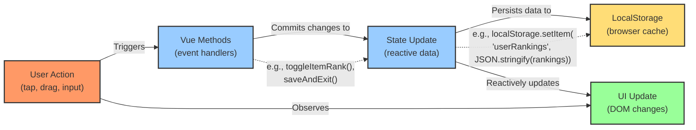
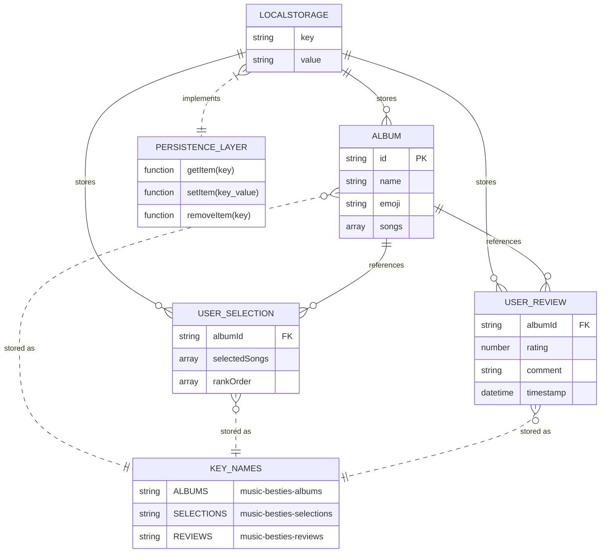

# Diagram Comparisons

This page provides side-by-side comparisons of ASCII diagrams and their enhanced Mermaid equivalents for the Music Besties documentation.

## 1. Application Architecture

### Current ASCII Version

```
+-----------------------------------------------------+
|                   Music Besties                     |
+-----------------------------------------------------+
|                                                     |
|  +-------------------+    +---------------------+   |
|  |                   |    |                     |   |
|  |    Dashboard      |<-->|    Edit Rankings    |   |
|  |     Screen        |    |       Screen        |   |
|  |                   |    |                     |   |
|  +-------------------+    +---------------------+   |
|           |                         |               |
|           v                         v               |
|  +-------------------+    +---------------------+   |
|  |                   |    |                     |   |
|  |  Album Sidebar    |    |  Confirmation       |   |
|  |     Panel         |    |     Modal           |   |
|  |                   |    |                     |   |
|  +-------------------+    +---------------------+   |
|                                                     |
+-----------------------------------------------------+
```

### Enhanced Mermaid Version



**Enhancements:**
- Added descriptive labels to each component
- Color-coded primary screens vs. supporting components
- Added relationship descriptions on connection lines
- Included tooltips for additional context
- Used subgraph to clearly define application boundary

## 2. Component Hierarchy

### Current ASCII Version

```
App.vue
  |
  |--- DashboardCard.vue (Multiple instances in grid)
  |
  |--- EditRankingsTabs.vue
  |      |
  |      |--- DraggableItem.vue (Multiple instances)
  |
  |--- SidebarPanel.vue
  |
  |--- ModalDialog.vue
```

### Enhanced Mermaid Version



**Enhancements:**
- Added component responsibilities in each node
- Used different styles to indicate component hierarchy levels
- Added annotations explaining relationships between components
- Included styling to distinguish between container components and leaf components

## 3. Data Structure Model

### Current ASCII Version

```
  +-------------------+
  |    Album Object   |
  +-------------------+
  | - id              |
  | - name            |
  | - emoji           |
  | - songs[]         |
  +-------------------+
          |
          v
  +-------------------+     +-------------------+
  |  User Selections  |     |   User Reviews    |
  +-------------------+     +-------------------+
  | - albumId         |     | - albumId         |
  | - selectedSongs[] |     | - rating          |
  | - rankOrder[]     |     | - comment         |
  +-------------------+     | - timestamp       |
                            +-------------------+
```

### Enhanced Mermaid Version



**Enhancements:**
- Added stereotypes to indicate purpose of each class
- Included data types with generics for arrays
- Added methods to show available operations
- Used proper UML notation for relationships with cardinality
- Added explanatory notes for each class
- Specified relationship direction and type (composition)

## 4. Ranking Interaction Flow

### Current ASCII Version

```
+-----------------------------------------------------+
|                                                     |
|  Step 1: Initial State                              |
|  +---------------+        +---------------+         |
|  | Ranked:       |        | Unranked:     |         |
|  | (empty)       |        | • Item A      |         |
|  |               |        | • Item B      |         |
|  |               |        | • Item C      |         |
|  +---------------+        +---------------+         |
|                                                     |
|  Step 2: User taps Item B                           |
|  +---------------+        +---------------+         |
|  | Ranked:       |        | Unranked:     |         |
|  | 1. Item B     |        | • Item A      |         |
|  |               |        | • Item C      |         |
|  |               |        |               |         |
|  +---------------+        +---------------+         |
|                                                     |
|  Step 3: User taps Item A                           |
|  +---------------+        +---------------+         |
|  | Ranked:       |        | Unranked:     |         |
|  | 1. Item B     |        | • Item C      |         |
|  | 2. Item A     |        |               |         |
|  |               |        |               |         |
|  +---------------+        +---------------+         |
|                                                     |
|  Step 4: User taps Item B again (to unrank)         |
|  +---------------+        +---------------+         |
|  | Ranked:       |        | Unranked:     |         |
|  | 1. Item A     |        | • Item B      |         |
|  |               |        | • Item C      |         |
|  |               |        |               |         |
|  +---------------+        +---------------+         |
|                                                     |
+-----------------------------------------------------+
```

### Enhanced Mermaid Version



**Enhancements:**
- Added clear participant lanes showing the interaction between User, UI, and State
- Included method calls to show the actual implementation details
- Added descriptive notes at each step to show the UI state
- Included a summary of key behaviors at the end
- Used proper sequence diagram notation for actions and responses

## 5. Data Flow Implementation

### Current ASCII Version

```
+-------------+     +-------------+     +-------------+
| User Action | --> | Vue Methods | --> | State Update|
+-------------+     +-------------+     +-------------+
      |                                        |
      v                                        v
+-------------+                        +-------------+
| UI Update   | <----------------------| LocalStorage|
+-------------+                        +-------------+
```

### Enhanced Mermaid Version



**Enhancements:**
- Added descriptive subtitles to each component
- Used color coding to distinguish different types of operations
- Added specific method examples to illustrate implementation
- Used directional labels to explain the purpose of each connection
- Added a feedback loop showing how user actions relate to UI updates

## 6. LocalStorage Structure

### Current ASCII Version

```
LocalStorage {
  "music-besties-albums": [
    {
      "id": "red",
      "name": "Red",
      "emoji": "❤️",
      "songs": ["All Too Well", "22", ...]
    },
    ...
  ],
  
  "music-besties-selections": {
    "red": {
      "selectedSongs": ["All Too Well", "22", ...],
      "rankOrder": ["All Too Well", "State of Grace", ...]
    },
    ...
  },
  
  "music-besties-reviews": {
    "red": {
      "rating": 5,
      "comment": "Amazing album!",
      "timestamp": "2025-04-15T14:30:00Z"
    },
    ...
  }
}
```

### Enhanced Mermaid Version



**Enhancements:**
- Used proper ER diagram notation with cardinality
- Added primary and foreign key indicators
- Included data types for all fields
- Added implementation details showing the persistence layer
- Included actual key names used in LocalStorage
- Showed relationships between different data entities
