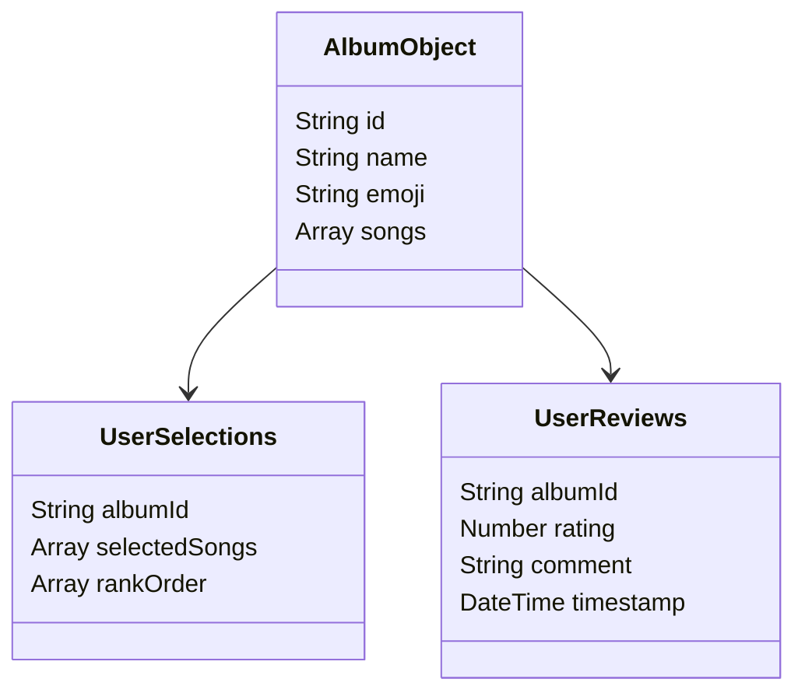

# Data Structure Model - Mermaid Example

This page demonstrates how the Data Structure Model from the technical documentation would look when converted to Mermaid format.

## Original ASCII Diagram

```
  +-------------------+
  |    Album Object   |
  +-------------------+
  | - id              |
  | - name            |
  | - emoji           |
  | - songs[]         |
  +-------------------+
          |
          v
  +-------------------+     +-------------------+
  |  User Selections  |     |   User Reviews    |
  +-------------------+     +-------------------+
  | - albumId         |     | - albumId         |
  | - selectedSongs[] |     | - rating          |
  | - rankOrder[]     |     | - comment         |
  +-------------------+     | - timestamp       |
                            +-------------------+
```

## Mermaid Version



## Benefits of Mermaid Format

1. **Improved Readability**: The Mermaid diagram provides a cleaner, more professional visualization of the data structure.

2. **Easier Maintenance**: When data structures change, updating a Mermaid diagram requires only modifying the code, not repositioning ASCII characters.

3. **Consistency**: Mermaid enforces consistent styling across all diagrams, creating a more unified documentation experience.

4. **Scalability**: Mermaid diagrams can easily be expanded to include more complex relationships without becoming unwieldy.

5. **Better Integration**: Mermaid diagrams are rendered as SVG, making them more accessible and responsive across different devices and screen sizes.

## Implementation Notes

When implementing this conversion:

1. Maintain the same conceptual relationships shown in the original diagram
2. Use appropriate Mermaid diagram types (class diagram for data structures)
3. Include all fields from the original diagram
4. Add proper data types for clarity
