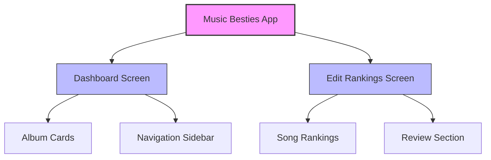
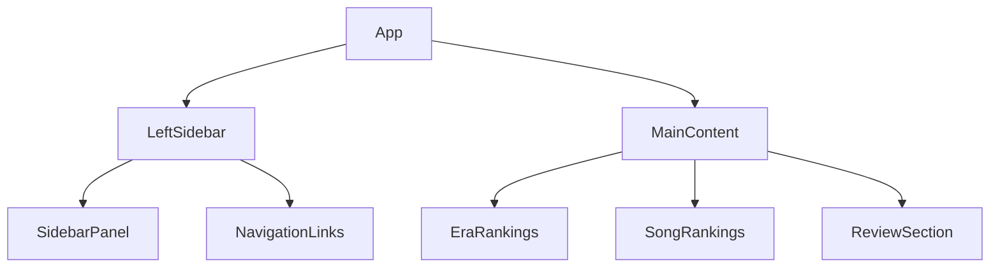
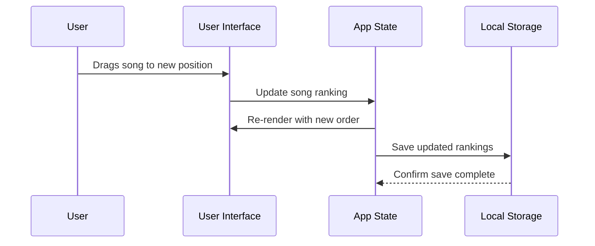
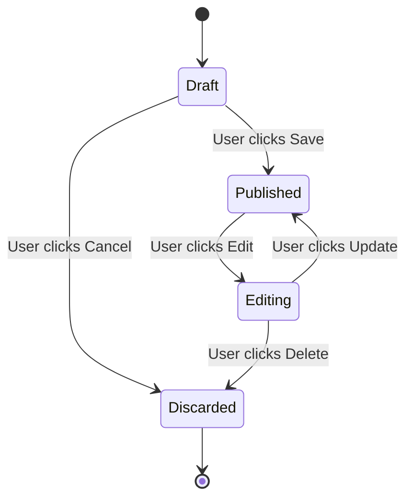
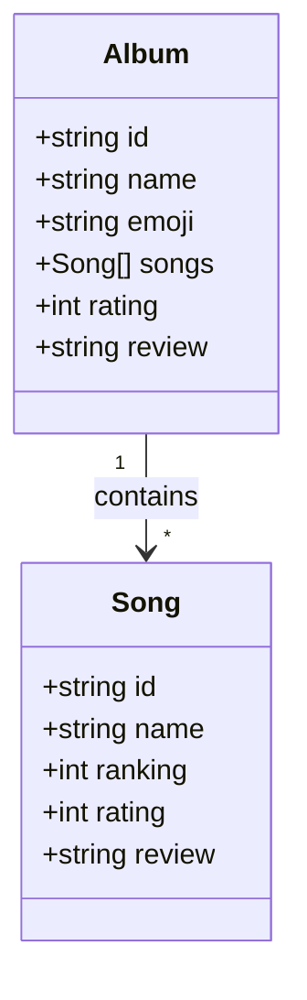
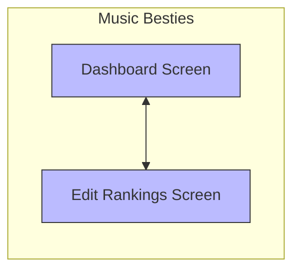

# Mermaid Diagram Examples

This page demonstrates various types of Mermaid diagrams that can be used in the Music Besties documentation.

## Application Architecture

This flowchart shows the high-level architecture of the Music Besties application:



## Component Hierarchy

This diagram shows the component hierarchy:



## Data Flow

This sequence diagram shows the data flow when a user updates a ranking:



## State Transitions

This state diagram shows the possible states of a review:



## Class Diagram

This class diagram shows the data model:



## Comparison with ASCII Diagrams

### ASCII Version (Current)
```
+-----------------------------------------------------+
|                   Music Besties                     |
+-----------------------------------------------------+
|                                                     |
|  +-------------------+    +---------------------+   |
|  |                   |    |                     |   |
|  |    Dashboard      |<-->|    Edit Rankings    |   |
|  |     Screen        |    |       Screen        |   |
|  |                   |    |                     |   |
|  +-------------------+    +---------------------+   |
```

### Mermaid Version (Proposed)


## Benefits of Mermaid Diagrams

1. **Maintainability**: Text-based format is easier to update than ASCII art
2. **Readability**: Cleaner visual presentation with styling options
3. **Consistency**: Standardized format across all diagrams
4. **Interactivity**: Some diagrams support zooming and panning
5. **Version Control**: Changes to diagrams can be tracked in Git
